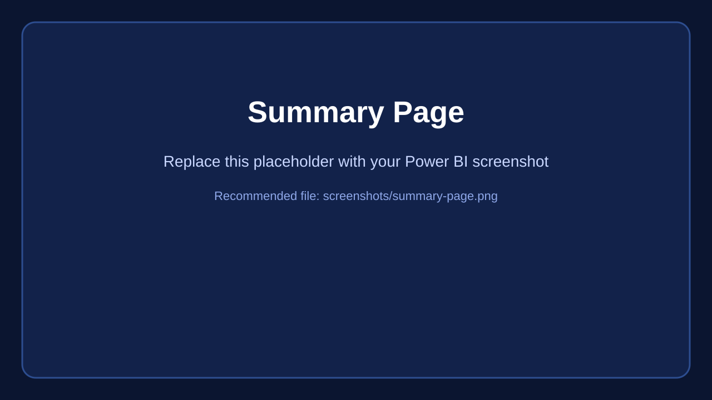
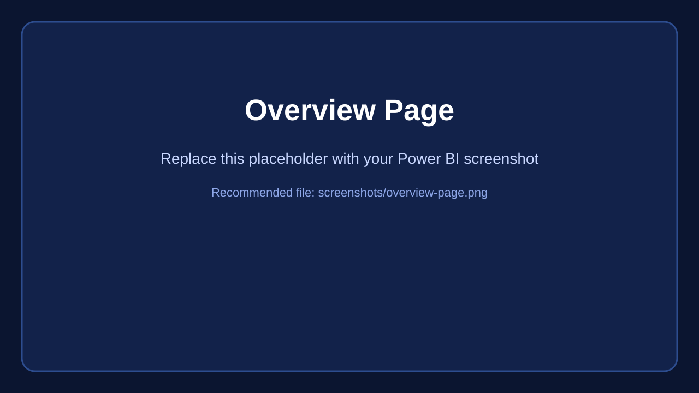
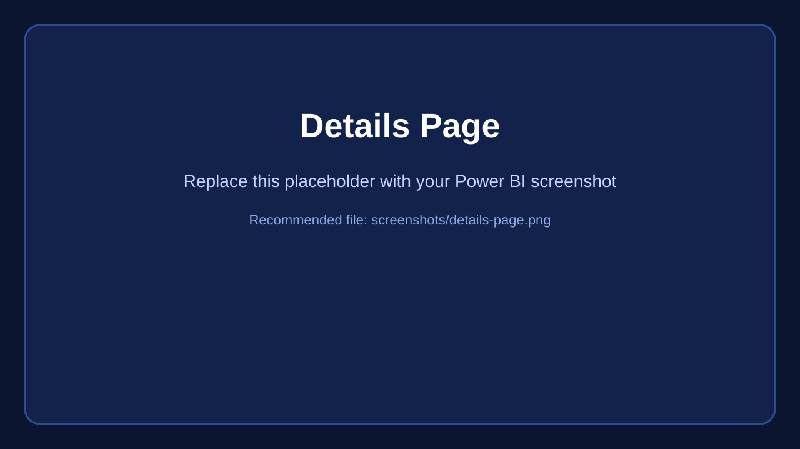
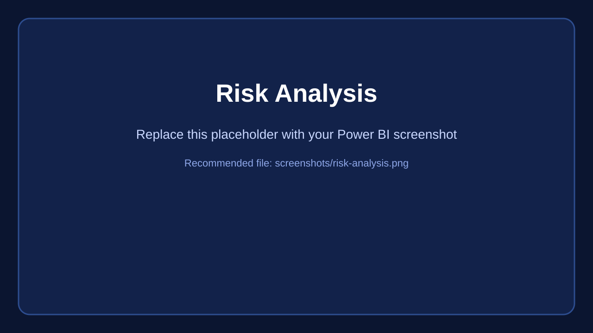
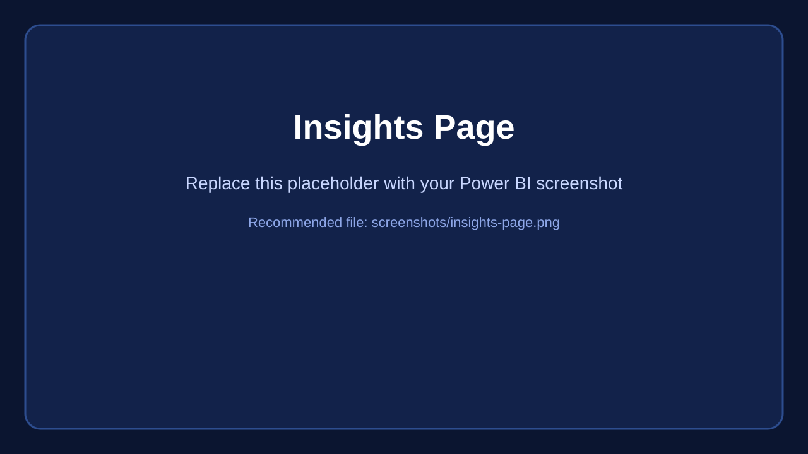

# Bank Loan Analysis Dashboard

A Power BI dashboard project for analyzing bank loan performance, loan quality, borrower behavior, and portfolio trends across time, geography, and loan characteristics.

## What this project shows

- **Executive summary** with total applications, funded amount, amount received, average interest rate, and average DTI
- **Good vs bad loan analysis** using loan status segmentation
- **Monthly portfolio trends** for applications, funding, and collections
- **State, term, employment length, purpose, and home ownership breakdowns**
- **Loan-level detail view** for drilling into individual records

## Report pages

| Page | Purpose |
|---|---|
| **Summary** | High-level KPI cards and good/bad loan split |
| **Overview** *(spelled `Overveiw` in the PBIX)* | Portfolio analysis by month, state, term, employment length, purpose, and home ownership |
| **Details** | Record-level table with filters for deep inspection |

## KPI logic

The report is based on the query document included in this repo and uses measures such as:

- Total Loan Applications
- Total Funded Amount
- Total Amount Received
- Average Interest Rate
- Average DTI
- Good Loan Percentage / Bad Loan Percentage
- Good Loan Applications / Bad Loan Applications
- Good Loan Funded Amount / Bad Loan Funded Amount
- Good Loan Amount Received / Bad Loan Amount Received

## Data dimensions used

- Loan status
- Issue date
- State
- Term
- Employment length
- Purpose
- Home ownership

## Design notes

- Dark dashboard theme for a premium finance-style look
- Fluent 2 theme package
- USA state shape map for geography analysis
- Slicers and drill-friendly report structure

## Repository content

```text
README.md
assets/
├── README.md
data/
├── README.md
dax/
├── Power_BI_Measures.dax
sql/
├── Data_Validation_Queries.sql
project_images/screenshots/
├── summary-page.svg
├── overview-page.svg
├── details-page.svg
├── risk-analysis.svg
├── insights-page.svg
└── README.md
power_bi_code/
├── bank loan data-dashboard.pbix
└── BANK LOAN REPORT - QUERY DOCUMENT.docx
```

## How to use

1. Open `power_bi_code/bank loan data-dashboard.pbix` in **Power BI Desktop**
2. Review `power_bi_code/BANK LOAN REPORT - QUERY DOCUMENT.docx` for the KPI logic and groupings
3. Refresh or replace the dataset if needed
4. Export dashboard screenshots and replace the placeholder files in `project_images/screenshots/`
5. Keep the same screenshot names so the README preview links stay valid

## Dashboard preview

Replace the placeholder files below with your real dashboard screenshots:







## Suggested GitHub presentation

Present the project like a product page:

**Bank Loan Analysis Dashboard**  
Power BI analytics project for portfolio monitoring, loan quality tracking, and borrower segmentation.

Add these sections near the top of your repo:

1. Short project summary
2. Dashboard preview images
3. Business questions answered
4. KPI / measure logic
5. Report page breakdown
6. How to open and use the PBIX file

## What to replace

- Replace each `.svg` placeholder in `project_images/screenshots/` with a `.png` export from Power BI
- Keep the same base filenames if you want the README links to remain unchanged
- If you prefer, you can keep the `.svg` placeholders and simply add your final screenshots alongside them

## Business questions answered

- How many loan applications were received?
- How much capital was funded and how much was collected?
- What portion of loans are good vs bad?
- Which states generate the most loan activity?
- How do term, purpose, and employment length affect loan behavior?

## Future enhancements

- Add a KPI summary section for monthly and year-over-year comparison
- Add borrower segmentation by income band and credit risk
- Add a dedicated insights page with written findings
- Add exported dashboard images to the repo for a stronger GitHub landing page

## Recommended architecture upgrades

If you want this to look like a polished Power BI application, add these next:

| Area | Improvement |
|---|---|
| **Modeling** | Create a proper date table and use it for all month-to-date / previous-month logic |
| **Measures** | Move KPI logic into named DAX measures instead of relying on ad hoc visual queries |
| **Navigation** | Add a home page, page navigator, and bookmark-driven buttons |
| **UX** | Add custom tooltips, drillthrough pages, and back buttons |
| **Insights** | Add a written insights page with 5–10 key observations |
| **Risk view** | Add delinquency, charge-off, and collection-rate KPIs |
| **Borrower view** | Add income band, grade/subgrade, and ownership segmentation |
| **Performance** | Reduce repeated visuals and use summarized measures for heavy tables |
| **Documentation** | Include a data dictionary, measure list, and screenshot gallery in the repo |

## Extra pages I would add

1. **Insights** — executive takeaways and anomalies.
2. **Risk Analysis** — delinquency, charge-off, and portfolio quality trends.
3. **Borrower Profile** — income, grade, employment, and home ownership breakdowns.
4. **Collections** — payment behavior, recovery, and monthly collection rate.
5. **Data Dictionary** — column definitions and KPI formulas.
