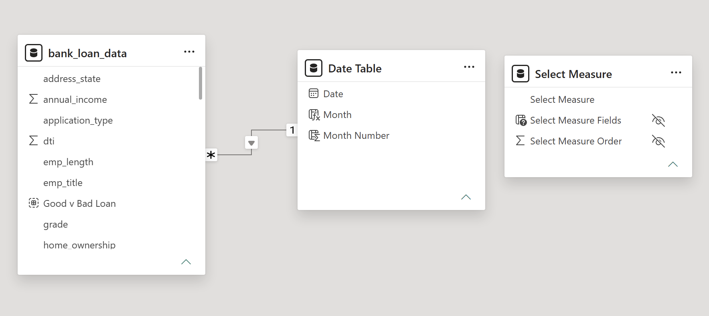

# Models

This folder documents the semantic model behind the Power BI report.

## Model overview

The report model is built around three main tables:

- **Fact table:** `bank_loan_data`
- **Date table:** `Date Table`
- **Measure selector table:** `Select Measure`

## Model view

The screenshot shows:

- A single active relationship from `bank_loan_data[issue_date]` to `Date Table[Date]`
- `Date Table` acting as the dedicated time dimension for monthly analysis
- `Select Measure` kept disconnected so it can be used as a measure selector / switcher

## What the model should communicate

| Area | Detail |
|---|---|
| **Relationships** | Star-schema style design with `bank_loan_data` at the center |
| **Time intelligence** | `Date Table` used for MTD, PMTD, and monthly trend calculations |
| **Measure design** | Reusable DAX measures driven by a dedicated selector table |
| **Analysis flow** | Summary, overview, and detail pages support layered analysis |

## Table details

### `bank_loan_data`

The main fact table contains the raw lending data used for the report. Key fields include:

- `id`, `member_id`
- `issue_date`, `last_payment_date`, `next_payment_date`, `last_credit_pull_date`
- `loan_status`, `purpose`, `grade`, `sub_grade`, `term`
- `annual_income`, `dti`, `int_rate`, `installment`, `loan_amount`, `total_payment`
- `address_state`, `application_type`, `home_ownership`, `emp_length`, `emp_title`, `verification_status`, `total_acc`

### `Date Table`

The date dimension is a small supporting table with:

- `Date`
- `Month`
- `Month Number`

It is used to sort months correctly and drive time-intelligence calculations.

### `Select Measure`

This is a disconnected helper table used for measure selection / switching in visuals.

- `Select Measure`
- `Select Measure Fields`
- `Select Measure Order`

## Relationships

| From | To | Cardinality | Use |
|---|---|---|---|
| `bank_loan_data[issue_date]` | `Date Table[Date]` | Many-to-one | Drives monthly trends and DAX time intelligence |

The `Select Measure` table remains disconnected so it can act as a visual-level measure picker.

## Business grouping used in the model

- **Good Loan** = `Fully Paid` + `Current`
- **Bad Loan** = `Charged Off`

That grouping supports portfolio quality analysis across applications, funded amount, and amount received.

## Why this matters

Recruiters can see that the report was built with a proper analytical model instead of ad hoc visuals and one-off calculations. It also shows that the report was designed for time-based analysis, measure switching, and loan-quality segmentation.

## Supporting documentation

See the `documents/` folder for the business context, terminology, and report notes that informed this model.
